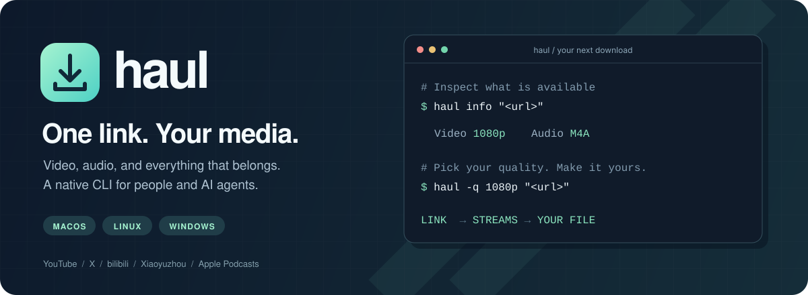
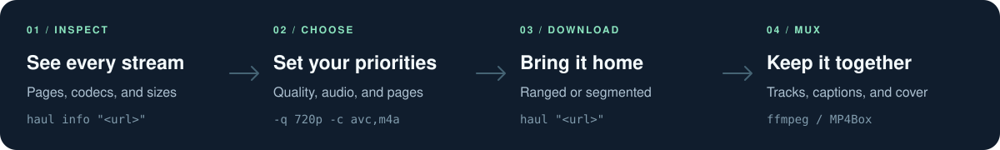

<p align="center">
  
</p>

<!-- languages:start -->
<p align="center">
  <bdi><strong>English</strong></bdi> ·
  <a href="README.zh-CN.md"><bdi>简体中文</bdi></a> ·
  <a href="README.zh-TW.md"><bdi>繁體中文</bdi></a> ·
  <a href="README.ja.md"><bdi>日本語</bdi></a> ·
  <a href="README.hi.md"><bdi>हिन्दी</bdi></a> ·
  <a href="README.es.md"><bdi>Español</bdi></a> ·
  <a href="README.ar.md"><bdi>العربية</bdi></a> ·
  <a href="README.fr.md"><bdi>Français</bdi></a><br>
  <a href="README.bn.md"><bdi>বাংলা</bdi></a> ·
  <a href="README.pt.md"><bdi>Português</bdi></a> ·
  <a href="README.id.md"><bdi>Bahasa Indonesia</bdi></a> ·
  <a href="README.ur.md"><bdi>اردو</bdi></a> ·
  <a href="README.ru.md"><bdi>Русский</bdi></a> ·
  <a href="README.de.md"><bdi>Deutsch</bdi></a> ·
  <a href="README.pcm.md"><bdi>Naijá</bdi></a> ·
  <a href="README.arz.md"><bdi>مصري</bdi></a>
</p>
<!-- languages:end -->

<p align="center">
  <a href="https://github.com/ac1982/haul/actions/workflows/build.yml"></a>
  <a href="https://github.com/ac1982/haul/releases"></a>
  
  
  <a href="LICENSE"></a>
</p>

<p align="center">
  <strong>A command-line downloader for video and audio, built for people and AI agents alike.</strong><br>
  Give it a link. Choose your streams. Get video, audio, subtitles, chapters, and cover in one file.
</p>

<p align="center">
  <a href="#install">Install</a> ·
  <a href="#usage">Quick start</a> ·
  <a href="#sites">Supported sites</a> ·
  <a href="#for-ai-agents-and-scripts">Agent guide</a> ·
  <a href="#options">Options</a> ·
  <a href="../../releases">Releases</a>
</p>

---

## Small command. Complete download.

| ↓ Your media, your way | ⌘ One binary, every desktop | { } Ready for automation |
| :--- | :--- | :--- |
| Pick quality, codecs, pages, and file names with the same vocabulary across five sites | A single Go binary for macOS, Linux and Windows, with parallel ranged downloads that resume | One JSON document on stdout, logs on stderr, meaningful exit codes, and no prompts without a terminal |

<p align="center">
  
</p>

<details>
<summary><strong>Take a look inside the terminal</strong></summary>

```
$ haul info -q 720p "https://youtu.be/DdCEmlAydcw"
haul v1.0.0

  Inside Anthropic's molecular biology lab
  channel Anthropic  ·  2026-09-24  ·  00:01:15

  Video
  ▶  0  720p   1190×720   AVC  24fps   755 kbps    6.8 MB
     1  720p   1190×720   VP9  24fps   528 kbps    4.7 MB
     2  720p   1190×720   AV1  24fps   388 kbps    3.5 MB
     3  1080p  2048×1240  VP9  24fps  5827 kbps   52.3 MB
     …
    19  144p   238×144    AVC  24fps    50 kbps  459.0 KB
  Audio
  ▶ 0  OPUS  131 kbps    1.2 MB
    1  M4A   130 kbps    1.2 MB
    …
```

</details>

> For personal, research and other non-commercial use. You are responsible for respecting copyright and each site's terms.

## Install

haul runs on **macOS, Linux and Windows** (amd64 and arm64). It needs [ffmpeg](https://ffmpeg.org) for muxing; YouTube and X also need [yt-dlp](https://github.com/yt-dlp/yt-dlp), and YouTube's player challenges need [deno](https://deno.com):

```sh
brew install ffmpeg yt-dlp deno          # macOS
sudo apt install ffmpeg pipx unzip curl  # Linux (Debian / Ubuntu)
pipx install "yt-dlp[default]" && pipx ensurepath
curl -fsSL https://deno.land/install.sh | sh -s -- -y
winget install Gyan.FFmpeg               # Windows, one package at a time
winget install yt-dlp.yt-dlp
winget install DenoLand.Deno
```

On Linux, install yt-dlp with pipx or as the `yt-dlp_linux` binary from its [releases](https://github.com/yt-dlp/yt-dlp/releases/latest) (`yt-dlp_linux_aarch64` on arm64), not from your distribution: YouTube changes often, and packaged versions fall behind. Open a new terminal after installing, so the tools are on your `PATH`.

### Get the binary

Download the archive for your system from [Releases](../../releases) — `haul-<version>-<os>-<arch>.tar.gz` (`.zip` on Windows) — and put `haul` anywhere on your `PATH`:

```sh
tar -xzf haul-*-darwin-arm64.tar.gz
mkdir -p ~/.local/bin && mv haul-*/haul ~/.local/bin/
```

macOS releases built by the current workflow are signed and notarized with Apple. Choose `haul-<version>-darwin-<arch>.pkg` for an installer with an attached notarization ticket; it installs `haul` into `/usr/local/bin`. The archive contains the same signed executable, but its first verification may need an internet connection. Older releases may be unsigned.

<details>
<summary><strong>Build from source</strong> · Go 1.26+</summary>

```sh
go install github.com/ac1982/haul/cmd/haul@latest
```

or, from a clone:

```sh
go build -o haul ./cmd/haul
```

</details>

## Usage

Start with a link. haul chooses the best available streams by default.

```sh
haul "https://youtu.be/DdCEmlAydcw"
```

Inspect before downloading, or choose a quality and codec:

```sh
haul info "https://youtu.be/DdCEmlAydcw"
haul -q 720p -c avc,m4a "https://youtu.be/DdCEmlAydcw"  # H.264 + AAC for QuickTime
```

<details>
<summary><strong>Command reference</strong></summary>

```text
haul <url> [options]          download (same as `haul download <url>`)
haul info <url> [--urls]      show the item, its pages and streams; download nothing
haul login bilibili           log in to bilibili for higher qualities
haul templates                file-name template variables
haul --help                   sites, agent usage, exit codes, examples
haul download --help          every option
```

</details>

### Sites

| Site | Links | Needs |
|---|---|---|
| **YouTube** | `youtube.com/watch?v=…`, `youtu.be/…`, `/shorts/…`, `/embed/…`, `/live/…` | yt-dlp, deno |
| **X** | `x.com/<user>/status/<id>`, `twitter.com/…`; `/video/<n>` picks one video of a post | yt-dlp |
| **bilibili** | videos, bangumi, courses, collections, series, favorites, user spaces, `b23.tv`, bare `BV…` `av…` `ep…` `ss…` `md…` | – |
| **Xiaoyuzhou** | `xiaoyuzhoufm.com/episode/<id>`, `/podcast/<id>` | – |
| **Apple Podcasts** | `podcasts.apple.com/<cc>/podcast/<name>/id<show>`, with `?i=<episode>` for one episode | – |

### Make it yours

**Just the audio**

```sh
haul --audio-only "https://youtu.be/DdCEmlAydcw"
haul --audio-only -c m4a "https://youtu.be/DdCEmlAydcw"   # AAC rather than Opus
```

**A few parts, a whole season, or the latest episode**

```sh
# Selected parts, saved to your Movies folder
haul -p 1-3,10 -w ~/Movies "https://www.bilibili.com/video/BV1Wv411h7kN"

# Every episode of a season
haul -p ALL "https://www.bilibili.com/bangumi/play/ss33073"

# The newest podcast episode
haul -p LAST "https://podcasts.apple.com/us/podcast/the-daily/id1200361736"

# Every video in an X post
haul -p ALL "https://x.com/<user>/status/<id>"
```

**Organized files, subtitles, or an interactive choice**

```sh
haul -o "<uploader>/<title> [<quality>]" "https://youtu.be/DdCEmlAydcw"
haul --sub-lang en,zh "https://youtu.be/DdCEmlAydcw"   # only these subtitle languages
haul -i "BV1qt4y1X7TW"                                 # choose streams with the arrow keys
```

## For AI agents and scripts

`haul --help` carries everything an agent needs; [llms.txt](llms.txt) is the same guide as a file. The short version:

```sh
haul info --json "<url>"                                # 1. inspect
haul --json --video-stream 2 --audio-stream 0 "<url>"   # 2. download exactly those streams
haul --json -q 720p -c avc,m4a "<url>"                  #    or let priorities choose
```

- With `--json`, **stdout carries only one JSON document**; progress and logs go to stderr. Its `files` lists the output files, new or already there.
- **Nothing is interactive without a terminal.** `-i` without one fails with exit code 2 and names the flags to use instead.
- Stream indexes in `info` follow the order haul chooses in; pass the same `-q` / `-c` to `info` and to the download.
- `info` on a playlist, season, show or multi-video post lists its pages; `-p <n>` adds that page's streams and subtitles.
- Pages already on disk are reported as `"status": "skipped", "reason": "exists"`, so re-running is safe.

<details>
<summary><strong>Example JSON response</strong> · a successful download</summary>

A download prints:

```json
{
  "ok": true,
  "command": "download",
  "site": "youtube",
  "input": "https://youtu.be/DdCEmlAydcw",
  "title": "Inside Anthropic's molecular biology lab",
  "uploader": "Anthropic",
  "published": "2026-09-23T18:01:32Z",
  "description": "…",
  "pageCount": 1,
  "files": ["/Users/me/Movies/Inside Anthropic's molecular biology lab.mp4"],
  "pages": [
    {
      "index": 1,
      "id": "DdCEmlAydcw",
      "title": "Inside Anthropic's molecular biology lab",
      "durationSeconds": 75,
      "published": "2026-09-23T18:01:32Z",
      "selected": true,
      "status": "downloaded",
      "file": "/Users/me/Movies/Inside Anthropic's molecular biology lab.mp4",
      "sizeBytes": 3434260,
      "selectedVideo": 0,
      "selectedAudio": 0,
      "video": [{ "index": 0, "quality": "360p", "resolution": "594x360", "codec": "AVC", "fps": 24, "bitrateKbps": 214, "sizeBytes": 2014782 }],
      "audio": [{ "index": 0, "codec": "M4A", "bitrateKbps": 130, "sizeBytes": 1220994 }],
      "subtitles": [{ "lang": "en" }]
    }
  ]
}
```

That is `haul --json -q 360p -c avc,m4a …`. Here the keys are in reading order and the stream lists are cut to the chosen ones; the real document sorts its keys alphabetically and lists every stream.

</details>

A failure prints `"ok": false` with `"error": {"kind", "message", "exitCode"}`, and keeps the pages done before it.

| Exit code | Meaning | `error.kind` |
|---|---|---|
| 0 | done | – |
| 1 | the download or extraction failed | `failed` |
| 2 | unsupported link or bad option value | `input` |
| 3 | a required tool is missing (ffmpeg, yt-dlp) | `dependency` |
| 4 | login needed or expired | `auth` |
| 64 | bad command line (unknown flag, missing argument) | – |
| 130 | cancelled | `cancelled` |

## Options

`haul download --help` lists them all. The main ones:

| Group | Options |
|---|---|
| General | `--json`, `--config <file>`, `--debug` |
| Streams | `-q, --quality <list>`, `-c, --codec <list>`, `--video-stream <n>`, `--audio-stream <n>`, `-i, --interactive`, `--video-ascending`, `--audio-ascending` |
| Pages | `-p, --pages <spec>`, `--show-all`, `--hide-streams` |
| Content | `--audio-only`, `--video-only`, `--subtitle-only`, `--cover-only`, `--skip-subtitle`, `--sub-lang <list>`, `--auto-subtitles`, `--skip-cover`, `--skip-mux` |
| Output | `-o, --output <template>`, `--multi-output <template>`, `-w, --work-dir <dir>`, `--lang <code>`, `--no-tags`, `--archive`, `--delay <seconds>` |
| bilibili | `--api web\|tv\|app\|intl`, `--danmaku`, `--danmaku-only`, `--danmaku-format xml,ass`, `--cookie`, `--token`; more with `--help-hidden` |
| Tools | `--ffmpeg`, `--yt-dlp`, `--use-mp4box`, `--mp4box`, `--use-aria2c`, `--aria2c`, `--aria2c-args`, `--single-connection` |

<details>
<summary><strong>Quality and codec priorities</strong></summary>

**Qualities and codecs.** `-q` takes the labels the stream table shows: `1080p`, `720p60` on YouTube; `8K`, `Dolby Vision`, `HDR`, `4K`, `1080P60`, `1080P+`, `1080P`, `720P` on bilibili. `-c` takes `av1 vp9 hevc avc` for video and `m4a opus flac eac3 mp3` for audio. They are priorities, not filters: whatever is not listed comes after, best first. `--video-ascending` / `--audio-ascending` turn the order around for the smallest download.

</details>

<details>
<summary><strong>Page selection</strong></summary>

**Pages.** `8`, `1,2`, `3-5`, `1-3,10`, `ALL`, `LAST` (the last page, which is the newest episode of a show; `LATEST` works too). A link to one episode, or `?p=N`, selects that page by itself. Pages are the parts of a bilibili video, the episodes of a season, show or list, and the videos of an X post.

</details>

<details>
<summary><strong>File names and template variables</strong></summary>

**File names.** An item with one page: `<title>`; with several (even when `-p` takes one): `<title>/[P<pageNumberWithZero>]<pageTitle>`, zero-padded to the page count. Variables: `<title>` `<pageNumber>` `<pageNumberWithZero>` `<pageTitle>` `<id>` `<site>` `<uploader>` `<uploaderId>` `<quality>` `<resolution>` `<fps>` `<videoCodec>` `<videoBitrate>` `<audioCodec>` `<audioBitrate>` `<publishDate>` `<pageDate>`, plus bilibili's `<bvid>` `<aid>` `<cid>` `<api>`. Dates take a format: `<publishDate:yyyy-MM-dd>`. The extension is added.

</details>

## Site notes

<details>
<summary><strong>YouTube</strong> · extraction, subtitles, and playlists</summary>

YouTube protects its stream URLs with player challenges that need a JavaScript runtime, so extraction is left to `yt-dlp -J` (which runs them in deno); everything after that is haul's own. Uploaded subtitles are muxed in; auto-generated ones only with `--auto-subtitles`. googlevideo serves only bounded byte ranges, so tracks are fetched one 10 MB range at a time. `watch?v=…&list=…` downloads just the video. Keep yt-dlp current: that is where fixes for YouTube changes land.

</details>

<details>
<summary><strong>X</strong> · public posts and audio</summary>

X needs no login for public posts. Its videos are single MP4 files with the audio inside, so the table lists video only; `--audio-only` extracts the audio.

</details>

<details>
<summary><strong>bilibili</strong> · login, higher qualities, and danmaku</summary>

bilibili is read through its own web, TV, APP (gRPC) and international APIs. Logged out, it offers only lower qualities (typically up to 480P); log in for 1080P, 4K, HDR, Dolby Vision and Hi-Res audio:

```sh
haul login bilibili                # scan a QR code with the bilibili app
haul login bilibili --from-edge    # macOS: reuse Microsoft Edge's login (or --from-chrome; --profile "Profile 1")
haul login bilibili --tv           # TV access token, for --api tv / --api app
```

Reading a browser's login works only on macOS for now: it needs Full Disk Access for the terminal, and macOS asks once for the "Safe Storage" keychain item. `--danmaku` saves the bullet comments as XML and ASS; `--danmaku-format ass` keeps one of them.

</details>

<details>
<summary><strong>Xiaoyuzhou &amp; Apple Podcasts</strong> · episodes and metadata</summary>

Xiaoyuzhou and Apple Podcasts need no yt-dlp: Xiaoyuzhou pages carry the audio link, Apple links go through the public iTunes API and the show's RSS feed. Episodes keep their format (`.mp3` or `.m4a`) with the cover embedded, the show as album and the host as artist. A show link lists its latest episodes oldest first, so `-p LAST` is the newest.

</details>

## Config

`~/.config/haul/` (or `$HAUL_HOME`) holds:

| File | Purpose |
|---|---|
| `config.json` | defaults for any option |
| `cookie.txt`, `tv-token.txt`, `app-token.txt` | bilibili login |
| `archives.txt` | pages already downloaded (`--archive`) |

`config.json` uses the option names in camelCase, bilibili's under `"bilibili"`, and needs only what it changes; a list can be an array or a comma-separated string. Command-line flags override it:

```json
{
  "workDir": "~/Movies/haul",
  "codec": "avc,hevc,m4a",
  "quality": "1080p,1080P",
  "output": "<uploader>/<title>",
  "archive": true,
  "bilibili": { "danmaku": true, "danmakuFormat": ["ass"] }
}
```

## Development

```sh
go build ./cmd/haul
go test ./...                                  # offline, a few seconds
HAUL_LIVE=1 go test -run Live ./internal/...   # also hits bilibili, YouTube, X and Apple Podcasts
```

The offline suite never touches the network: tests talk to a stub `http.RoundTripper` that answers from recorded API responses and from simulated CDNs (range-only servers, dropped connections, servers that ignore ranges). End-to-end tests mux with a real ffmpeg and check the result with ffprobe; they are skipped when ffmpeg is not installed. See [AGENTS.md](AGENTS.md) for the architecture and conventions.

Pushing a `v*` tag tests, cross-compiles and publishes a release for every platform through GitHub Actions.

## Acknowledgements

[yt-dlp](https://github.com/yt-dlp/yt-dlp), [FFmpeg](https://ffmpeg.org), [GPAC](https://gpac.io), [aria2](https://aria2.github.io), [pflag](https://github.com/spf13/pflag), [x/term](https://pkg.go.dev/golang.org/x/term), [rsc.io/qr](https://pkg.go.dev/rsc.io/qr), and the API notes of [bilibili-API-collect](https://github.com/SocialSisterYi/bilibili-API-collect) and [bilibili-grpc-api](https://github.com/SeeFlowerX/bilibili-grpc-api).

## License

[MIT](LICENSE)

---

<p align="center">
  <strong>One link. Your media.</strong><br>
  <a href="#install">Get haul</a> · <a href="llms.txt">Agent reference</a> · <a href="AGENTS.md">Contribute</a>
</p>
